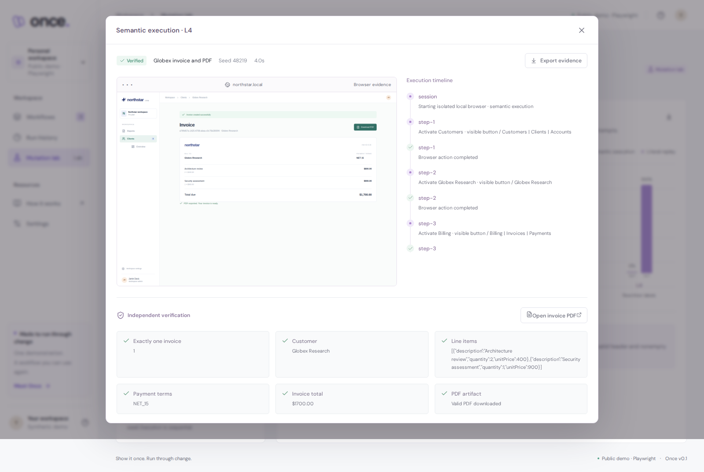

# Once

Show it once. Run through change.

Once is a browser-workflow laboratory hosted on AWS. Record an invoice task in the included Northstar CRM, inspect the compiled workflow, and compare execution by recorded selectors with execution by visible roles and supported equivalent labels.

The default mode uses a deterministic, invoice-specific compiler and local Playwright. Optional integrations now implement Amazon Bedrock intent enrichment and visible-target selection, plus AgentCore Browser execution with a scoped local fixture bridge. These integrations preserve the recorded action order; they do not train a model or infer a general policy. Live Nova inference is currently blocked: AWS reports `NOT_AUTHORIZED` and `ValidationException: Operation not allowed` for the configured account. See [the recording guide](docs/RECORDING.md) for the demo sequence and AWS launch settings.

Try the [live AWS demo](https://tpuqe8scax.us-east-1.awsapprunner.com), with no app login. The public demo uses synthetic data and ephemeral instance storage.



## Run locally

Use Node.js 24 LTS and a compatible npm release. From the project directory:

```bash
npm ci
npx playwright install chromium
npm run dev
```

Open http://localhost:5173. Vite serves the interface on port 5173 and proxies API requests to the Express server on port 3001. Leave both processes running while executing workflows. The runner can also use installed Microsoft Edge if its bundled Chromium is unavailable.

For a built local preview:

```bash
npm run build
ONCE_WEB_ORIGIN=http://localhost:3001 npm start
```

Open http://localhost:3001. The environment assignment above applies only to that process; `npm run dev` uses port 5173 by default. In PowerShell, set `$env:ONCE_WEB_ORIGIN = 'http://localhost:3001'` before `npm start`.

For the Linux production container:

```bash
docker build -t once:demo .
docker run --rm -p 127.0.0.1:3001:3001 once:demo
```

Open http://localhost:3001. On hosts where Docker's default network cannot resolve DNS, build with `docker build --network host -t once:demo .`.

## Try it

1. Run the bundled example from **Workflows**. It creates an Acme Robotics invoice with two line items, Net 30 terms, and a PDF.
2. Open **Mutation lab**, choose a seed and interface level, and compare both methods. Each execution receives a fresh scenario.
3. Choose **New demonstration** to record your own invoice. Select a customer, open Billing, create an invoice, and export its PDF. Then name and save the workflow.
4. Inspect the workflow specification, captured trace, execution timeline, screenshot, PDF, and verification checks.

The supported task accepts Acme Robotics, Globex Research, or Meridian Studio; one to eight line items; and Net 15, Net 30, or Net 60 terms. Item descriptions and amounts can differ from the example. Recording is scoped to the included Northstar interface.

## Checks and repeatable experiments

```powershell
npm run typecheck
npm test
npm run build
```

With `npm run dev` running in another terminal:

```powershell
npm run smoke
npm run smoke:recording
```

`smoke` runs the sample at seed 48219. It expects semantic execution to pass at L0, L2, and L4; literal replay to pass at L0; and literal replay to fail at L2 and L4. Expected baseline failures are successful test assertions. Screenshots are required for every run and PDFs for successful runs.

`smoke:recording` records a new Globex Research invoice through the interface, compiles its actual events, and executes it at L4 with seed 9042. The invoice totals $1,700 with Net 15 terms, including a line whose quantity remains at its default of one.

Initial local verification passed those six sample cases and the recorded Globex case. Successful runs passed all six business checks. These are smoke checks over a small fixed fixture, not a broad reliability benchmark. Re-run them against your environment; the mutation lab can also compare both methods across L0–L4.

Local-container and public AWS verification each covered 30 executions: three seeds, five cumulative levels, and both methods. Semantic binding passed 15/15; literal replay passed 6/15 (L0 and L1 only). See [verification evidence and limits](docs/VERIFICATION.md). Reproduce it against the built server or a public deployment:

```bash
ONCE_API_ORIGIN=http://localhost:3001 npm run smoke
ONCE_API_ORIGIN=http://localhost:3001 npm run smoke:recording
ONCE_API_ORIGIN=http://localhost:3001 npm run benchmark
```

The recording test uses `ONCE_UI_ORIGIN` if supplied, then `ONCE_API_ORIGIN`, then the development UI on port 5173. The benchmark writes full run evidence and runtime settings to `artifacts/benchmark.json` and spaces runs to respect public-mode limits.

| Level | Cumulative interface changes            |
| ----- | --------------------------------------- |
| L0    | Original interface                      |
| L1    | Cosmetic theme change                   |
| L2    | Seeded element IDs replace recorded IDs |
| L3    | Navigation and layout rearrangement     |
| L4    | Supported visible-label synonyms        |

The seed controls changed IDs. Theme, layout, and label transformations are fixed by level. Default local semantic binding has an explicit synonym vocabulary. With `ONCE_BEDROCK=1`, the model instead selects a validated exact role/name from observed visible controls. Neither mode recovers from arbitrary task changes.

## Local data and boundaries

Workflows, scenarios, and run history persist in `.data/store.json`. Browser screenshots and downloaded PDFs live in `.data/artifacts/`. Set `ONCE_DATA_DIR` to use another data directory. Generated data is excluded from Git.

The API binds to loopback by default and supports one browser run at a time. It has no user authentication or multi-tenant isolation. Browser requests are limited to the configured application origin; arbitrary external target URLs are unsupported. Use synthetic data on a trusted local machine. `ONCE_PUBLIC_DEMO=1` enables a bounded public demo mode for deployment, and is enabled on the verified App Runner deployment. See [deployment status and procedure](docs/DEPLOYMENT.md).

PDF verification checks the downloaded file's PDF header and minimum size, plus the saved invoice's export flag. Business checks compare the persisted invoice's customer, line items, terms, and total. PDF text is not independently parsed.

## Implementation and remaining work

Implemented: browser recording, versioned workflows with event provenance, deterministic compilation, local browser execution, selector baseline, visible-role binding, seeded scenarios, independent business checks, real PDF downloads, screenshots, and local run history.

Remaining from the broader brief: successful live Bedrock/AgentCore integration verification, richer workflow abstraction, additional task families, broader mutation coverage, statistically useful benchmark suites, and cloud persistence. See [ARCHITECTURE.md](ARCHITECTURE.md) and [DECISIONS.md](DECISIONS.md).

Released under the [MIT license](LICENSE).

Submission preparation: [submission project copy](docs/SUBMISSION.md), [verification evidence](docs/VERIFICATION.md), and the [AWS deployment diagram](docs/diagrams/once-deployment.svg). The public HTTPS endpoint runs the same deterministic compiler and Chromium executor.
